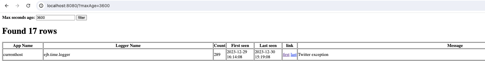

# GrayAlert

**GrayAlert** is a microservice designed to enhance your Graylog centralized logging system. It's a lightweight addition that notifies you about new, unique error logs, helping to filter out the noise and focus on what's important.

## Purpose

GrayAlert aims to identify and alert about anomalies in production microservices, ensuring that you're informed about new error types without being overwhelmed by redundant logs. It uses a suffix tree for anomaly detection ([Radix tree](https://en.wikipedia.org/wiki/Radix_tree), [PatriciaTrie](https://commons.apache.org/proper/commons-collections/apidocs/org/apache/commons/collections4/trie/PatriciaTrie.html)), ensuring efficient and accurate detection.

### Typical use-case

Imagine: You've just rolled out the latest version of your microservice into production. It's a moment of triumph, but also one of vigilance. What if new, unexpected errors pop up? NullPointerExceptions, bespoke error messages, or other anomalies - these gremlins can sneak in despite the most rigorous testing.

Enter GrayAlert, your new ally in proactive error monitoring! GrayAlert is specifically designed for these critical moments. It's not just about catching errors - it's about catching them the first time they appear. With GrayAlert, you're not bombarded with every single occurrence of a known issue. Instead, you're alerted only about the new, potentially critical errors that matter.

But here's the best part: GrayAlert integrates seamlessly with your favorite notification tools like Microsoft Teams, (TODO) Slack, and more. This means you get real-time alerts in the platforms you already use and love. No more sifting through endless logs when something goes wrong.

GrayAlert is especially useful when the unexpected happens. If pagerduty rings, GrayAlert's insights into new errors could be the key to swiftly pinpointing the root cause, saving precious time and effort.

This isn't just another error monitoring tool. GrayAlert is about giving you peace of mind. It's about making your post-release monitoring as smooth and stress-free as possible. It's about letting you focus on what you do best - creating amazing software - while it keeps an eye on the background, ensuring everything runs like clockwork. Welcome to a new era of smart, efficient, and proactive error management!


### Key Features:

- **Anomaly Detection:** New error types are detected based on a combination of the microservice name and logger class name. Messages are compared to a list of known messages, with a unique tokenization strategy to ensure accurate differentiation.
- **Graylog Integration:** Polls one or multiple Graylog instances via REST.
- **Data Persistence:** Stores known messages in a MySQL database.
- **Web Interface:** Explore the list of seen messages through a web interface (e.g., `http://localhost:8080/?maxAge=3600` for messages from the last hour).

- **Notification System:** Currently supports notifications via Microsoft Teams with the potential to expand to other platforms.

## Example Messages

| Timestamp           | Source             | LoggerName                     | Message                                     | Is It Interesting?                       |
|---------------------|--------------------|--------------------------------|---------------------------------------------|------------------------------------------|
| 2023-12-30 07:13:13 | accounting-service | com.example.AccountingApp      | Something went wrong with request 123       | Yes (first occurrence)                   | 
| 2023-12-30 07:13:14 | accounting-service | com.example.AccountingApp      | Something went wrong with response 456      | No (similar to previous)                 |
| 2023-12-30 07:13:15 | accounting-service | com.example.PersistenceManager | java.lang.NullPointerException              | Yes (different category)                 |
| 2023-12-30 07:13:16 | product-service    | com.example.PersistenceManager | java.lang.NullPointerException              | Yes (different microservice)             |
| 2023-12-30 07:13:17 | product-service    | com.example.PersistenceManager | java.lang.NullPointerException in service   | No (similar to already seen message)     |

## Installation

To set up GrayAlert:

1. **Graylog Credentials:** Obtain the base URL, username, and password for Graylog's REST interface.
2. **MySQL Setup:** Ensure MySQL is installed with DB_HOST, DB_USER, DB_PASSWORD, and DB_SCHEMA. GrayAlert will automatically create the necessary table (`log_example`).
3. **Teams Notification:** Set up an Incoming Webhook in MS Teams and configure `MS_TEAMS_URL` in GrayAlert.

### Docker

You can build an image by using
```
docker build -t graylog:latest .
```
or by using gradle jib:
```
./gradlew jibDockerBuild
```

You can use provided docker-compose.yaml to create a local mysql instance, you just have to provide details of your graylog installation and MS teams in .env file.

```
docker-compose up
```

after which you can access http://localhost:8080


## Contributing

We welcome contributions to make GrayAlert more versatile and powerful! Here are some areas where help would be greatly appreciated:

1. **Support for Various Logging Platforms:** Extend compatibility to platforms like Splunk, ELK, etc.
2. **Expand Notification Options:** Integrate Slack, email, and other notification channels.
3. **Daily Summary Reports:** Implement a feature to send daily emails summarizing seen errors and their counts.
4. **Enhance Anomaly Detection:** This is a crucial area - improving the log message anomaly detection mechanism.

---

Feel free to join in and contribute to making GrayAlert a more robust tool for log management and anomaly detection!
